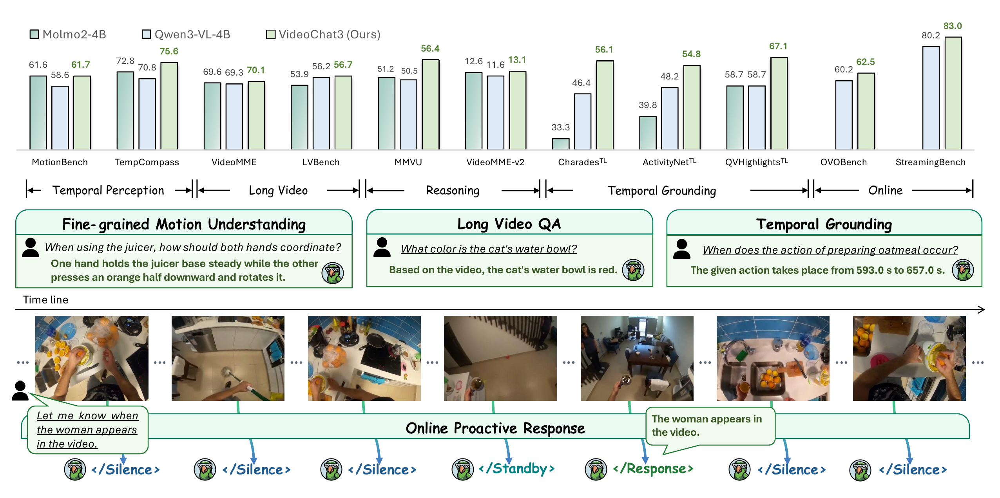

<p align="center">
  
</p>

<h1 align="center">VideoChat3</h1>

<p align="center">
  <strong>A Fully Open Architecture and Data Recipe for Efficient Video Instruction Training</strong>
</p>

<p align="center">
  <a href="https://arxiv.org/abs/2607.14935">
     <strong>Paper</strong>
  </a>
  &nbsp;&nbsp;&nbsp;
  <a href="https://mcg-nju.github.io/VideoChat3/">
     <strong>Homepage</strong>
  </a>
  &nbsp;&nbsp;&nbsp;
  <a href="https://huggingface.co/collections/MCG-NJU/videochat3">
     <strong>Models &amp; Data</strong>
  </a>
</p>

<p align="center">
  
</p>

<p align="center">
  <em>One model for fine-grained motion, long-video reasoning, temporal grounding, and online proactive response.</em>
</p>

## ✨ Overview

**VideoChat3** is a 4B generalist video MLLM built to understand video across time—from subtle motion and hour-long stories to precise temporal evidence and live streams.

It combines **I3D-ViT** for 16× spatiotemporal compression with **Adaptive Frame Resolution** for evidence-aware streaming, trained on **Academic2M**, **LV116K**, and **OL617K**.

## 🚀 Highlights

- 🎬 **Generalist video understanding:** one model for motion, long video, temporal grounding, and live streaming.
- ⚡ **Token-efficient architecture:** I3D-ViT compresses redundant visual tokens while preserving spatiotemporal evidence.
- 🔍 **Adaptive streaming perception:** frame resolution is increased only when closer visual inspection is needed.
- 🔓 **Open resources:** model weights and the complete training datasets are publicly available.

## 📋 TODO

- [x] 🤗 Release model weights and data
- [ ] 🛠️ Release training code

## 🌐 Project Page

The project homepage is maintained in [`docs/`](./docs) and deployed at <https://mcg-nju.github.io/VideoChat3/>.

## Citation

```
@misc{videochat3,
      title={VideoChat3: Fully Open Video MLLM for Efficient and Generalist Video Understanding}, 
      author={Xinhao Li and Yuhan Zhu and Xiangyu Zeng and Yuhao Dong and Haoning Wu and Zhiqiu Zhang and Yuandong Yang and Changlian Ma and Qingyu Zhang and Yansong Shi and Xinyu Chen and Haoran Chen and Zizheng Huang and Jun Zhang and Kun Ouyang and Lin Sui and Ziang Yan and Yicheng Xu and Chenting Wang and Yinan He and Hongjie Zhang and Yi Wang and Yu Qiao and Yali Wang and Ziwei Liu and Kai Chen and Limin Wang},
      year={2026},
      eprint={2607.14935},
      archivePrefix={arXiv},
      primaryClass={cs.CV},
      url={https://arxiv.org/abs/2607.14935}, 
}
```
